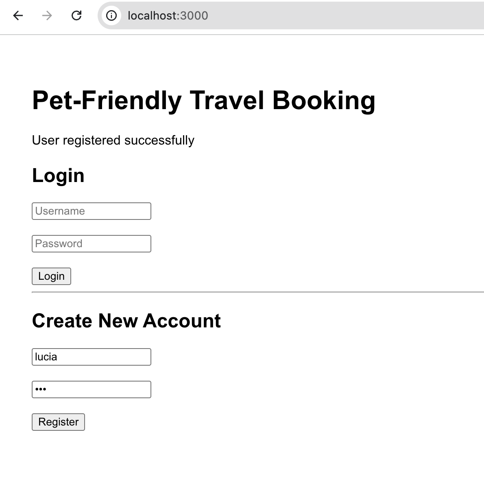
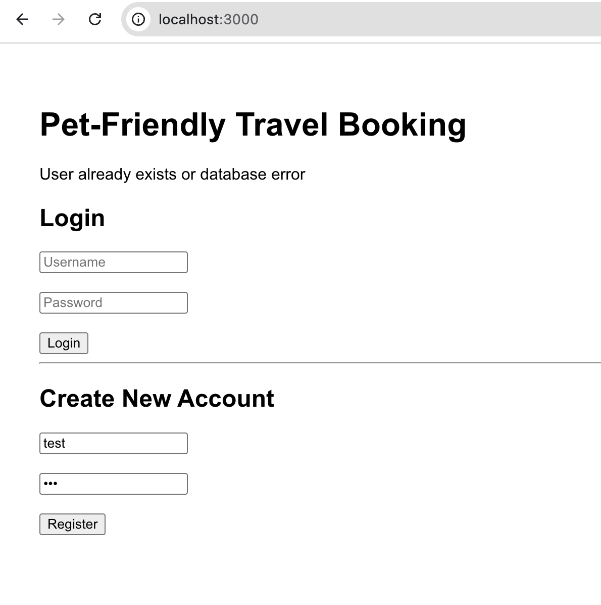
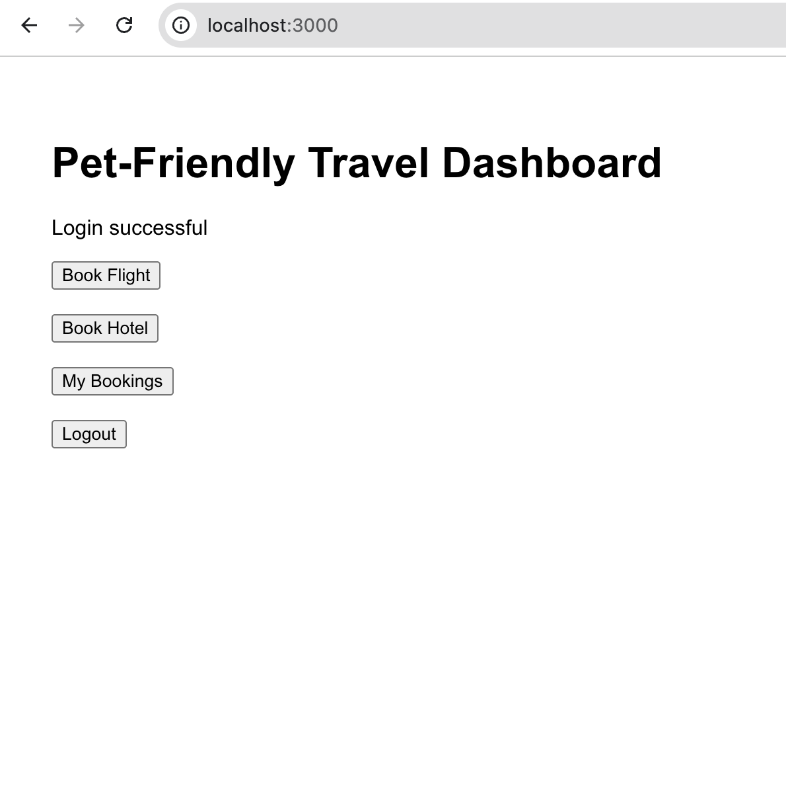
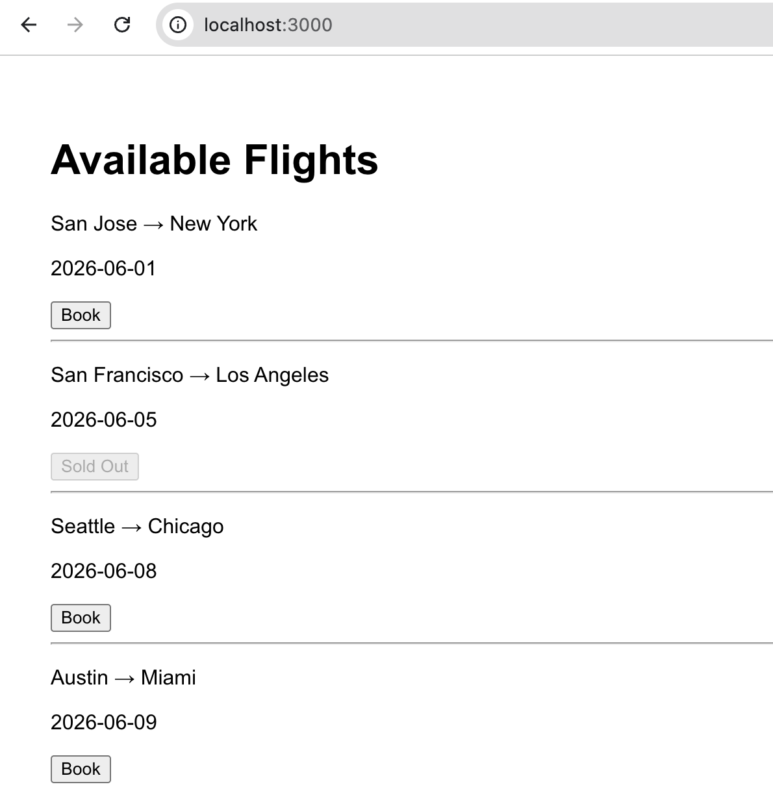
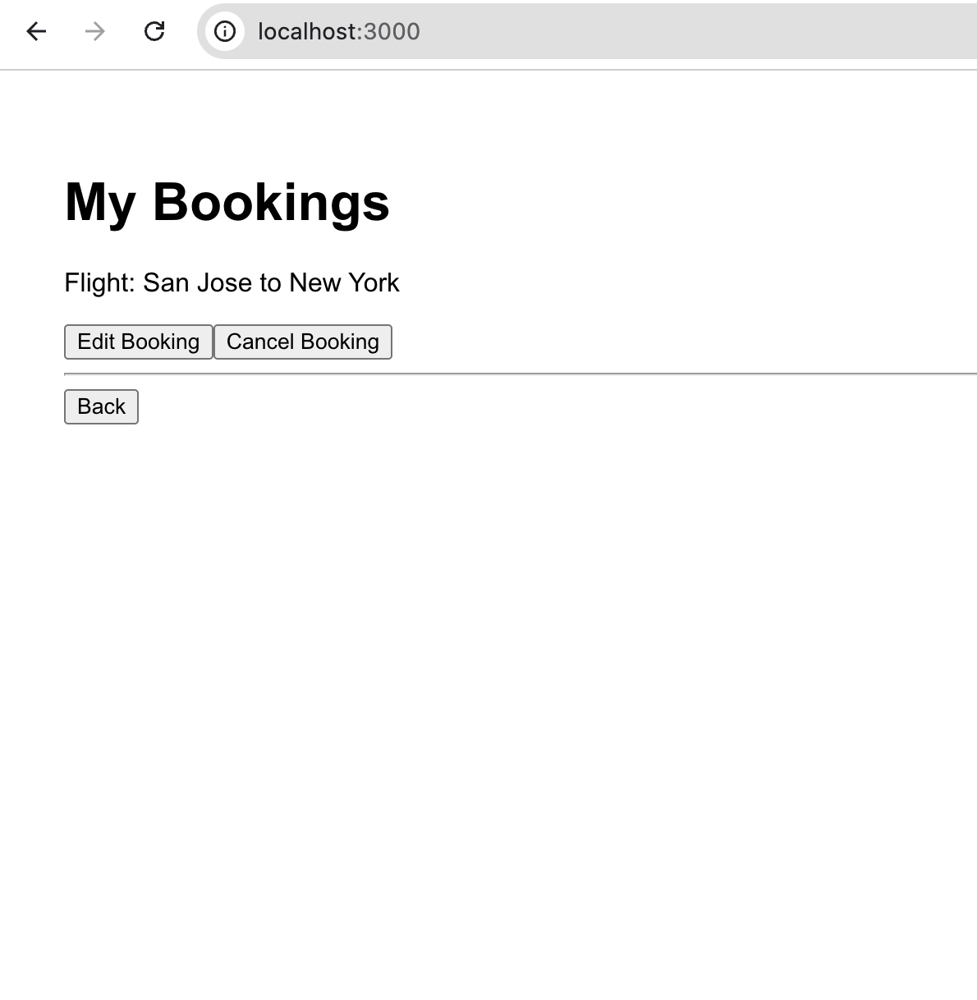
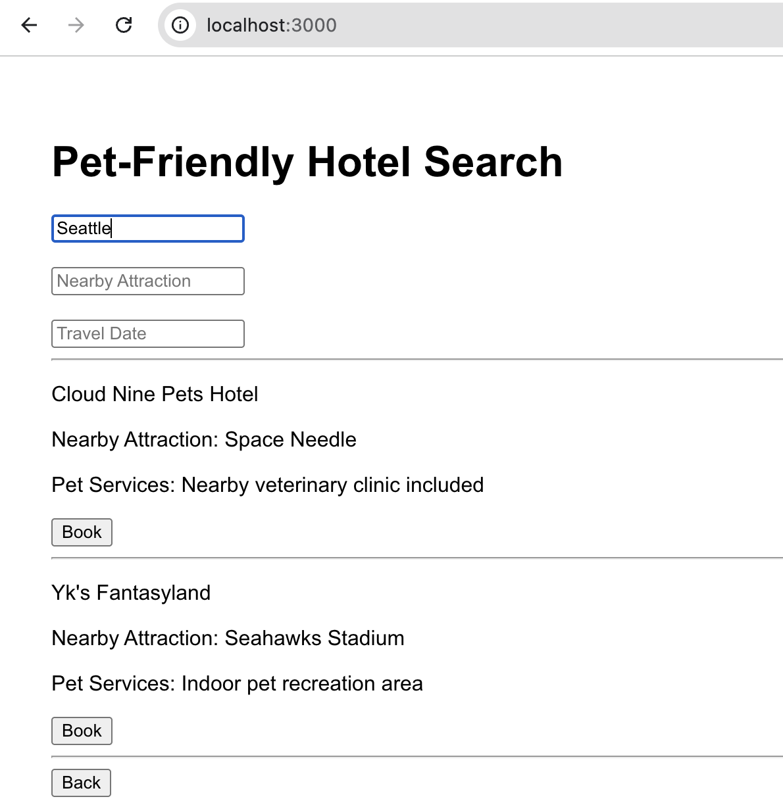
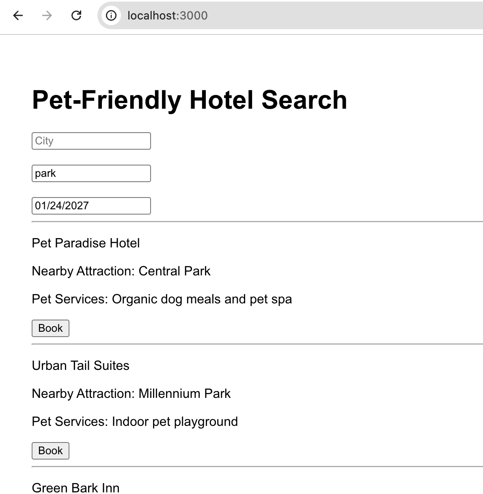
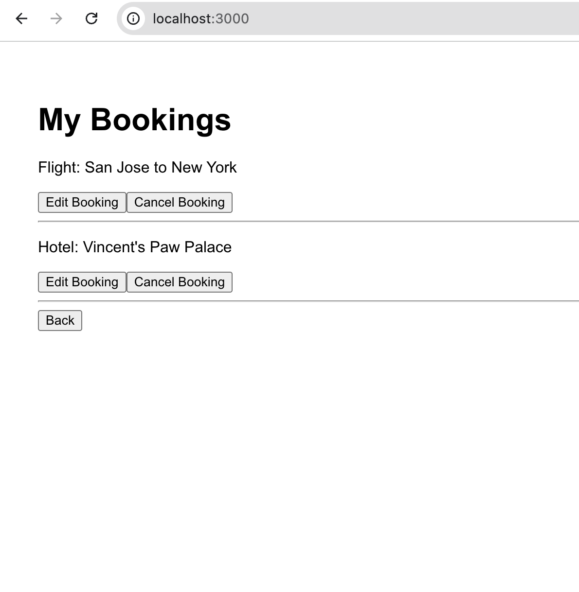
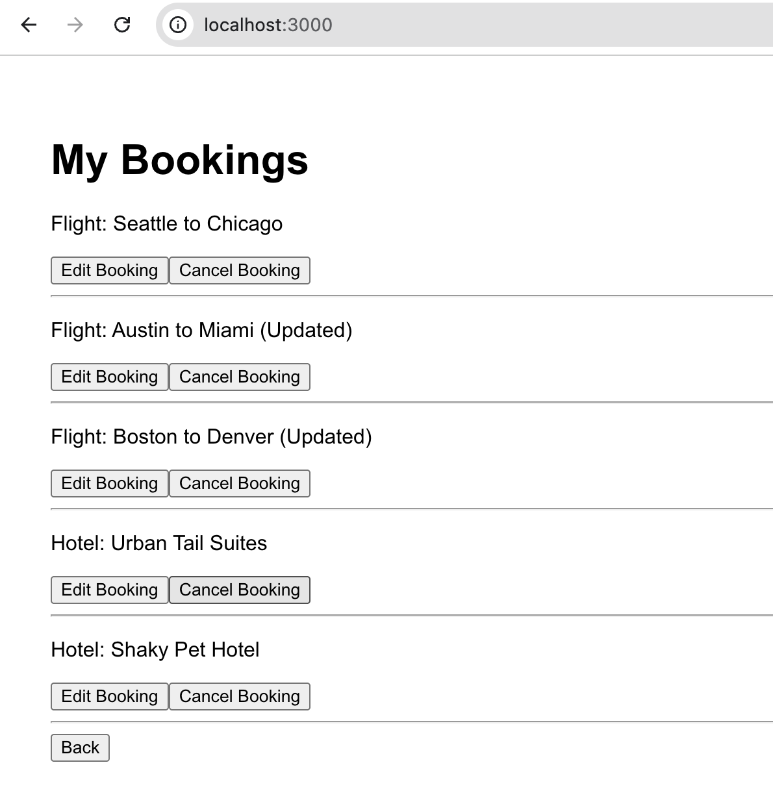

# Pet-Friendly Travel Booking Platform

## Overview

This project is a full-stack pet-friendly travel booking platform developed for CMPE 131 Software Engineering I.

The application allows users to:

- Create accounts and log in
- Book pet-friendly flights
- Search pet-friendly hotels near attractions
- View pet accommodation services
- Create bookings
- Edit bookings
- Cancel bookings

The system demonstrates frontend/backend integration, CRUD operations, authentication, and dynamic filtering using a React frontend with a Node.js + Express backend.

---

# Features

## User Authentication
- Register new accounts
- Login system
- SQLite user database integration


(user successfully created)


(account already exist)


(successfully logged in - viewing dashboard)

## Flight Booking
- View flights by:
  - departure city
  - destination city
  - travel date
- Sold-out flight handling
- Booking creation




## Hotel Booking
- Search hotels by:
  - city
  - nearby attraction
  - travel date
- Pet-friendly accommodation services
- Dynamic hotel filtering





## Booking Management
- View bookings
- Edit bookings
- Cancel bookings



## User Isolation
- Users are having individual platforms
- Security is granted, no data crossovers



---

# Tech Stack

## Frontend
- React
- JavaScript
- HTML/CSS

## Backend
- Node.js
- Express.js
- SQLite

---

# Project Structure

```bash
travel-agency-app/
travel-agency-node-api/
```

---

# How to Run the Project

## Backend

```bash
cd travel-agency-node-api
npm install
npm run dev
```

Backend runs on:
```bash
http://localhost:5001
```

---

## Frontend

```bash
cd travel-agency-app
npm install
npm start
```

Frontend runs on:
```bash
http://localhost:3000
```

---

# Demonstrated Functionalities

The project successfully demonstrates:

- Full CRUD operations
- Authentication system
- Dynamic frontend filtering
- Backend API communication
- SQLite database integration
- Pet-friendly travel search functionality

---

# Example Features Demonstrated

## Flight Search
- Dynamic filtering by route
- Booking functionality
- Sold-out state handling

## Hotel Search
- Attraction-based search
- Pet accommodation services
- Booking creation

## Booking Management
- Edit existing bookings
- Cancel bookings
- Persistent booking display

---

# Future Improvements

Potential future improvements include:

- Real travel APIs
- Payment integration
- Live hotel availability
- Cloud deployment
- Improved UI styling


## Authors

Yve Do
Travis Bui
Yoomi Kim
Vincent Nguyen 
Lucia Lu

## Data 

05/20/2026 